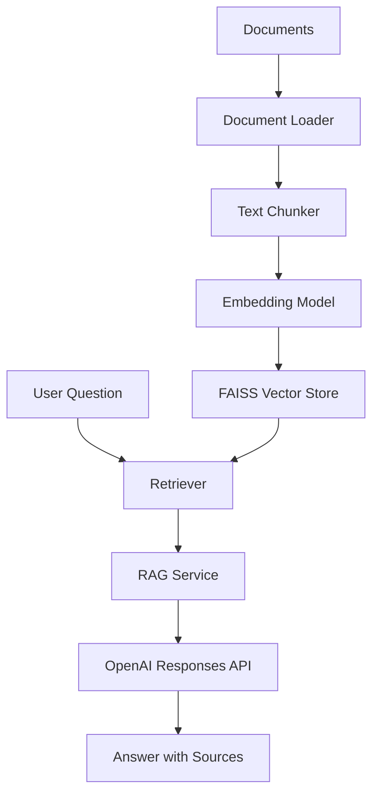

# Project 02 – Enterprise Retrieval-Augmented Generation (RAG)

## Overview

This project implements an Enterprise Retrieval-Augmented Generation (RAG) application using FastAPI, OpenAI, embeddings, semantic search, and FAISS vector storage.

The application ingests documents, splits them into searchable chunks, generates embeddings, stores them in a vector index, retrieves relevant context for a user question, and sends that context to an LLM to generate a grounded answer.

This project demonstrates how enterprise AI systems can answer questions using private or internal knowledge instead of relying only on the model's pre-trained knowledge.

## Objectives

- Build an end-to-end RAG pipeline
- Load and process enterprise documents
- Split documents into text chunks
- Generate semantic embeddings
- Store embeddings in FAISS
- Retrieve relevant document chunks
- Generate grounded responses using OpenAI
- Expose the RAG system through a FastAPI endpoint

## Architecture



## Technology Stack

- Python
- FastAPI
- OpenAI Responses API
- Sentence Transformers
- FAISS
- NumPy
- Pydantic
- Uvicorn
- python-dotenv

## Project Structure

```text
02-enterprise-rag/
├── app/
│   ├── api.py
│   ├── config.py
│   ├── rag_service.py
│   ├── ingestion/
│   ├── retrieval/
│   ├── vectorstore/
│   └── pipeline/
├── documents/
├── index/
├── tests/
├── .env.example
├── requirements.txt
└── README.md
```

## Configuration

Create a `.env` file in the project root:

```text
OPENAI_API_KEY=your_openai_api_key_here
OPENAI_MODEL=gpt-5.4-mini
```

Do not commit your `.env` file to GitHub.

| Variable | Required | Description | Example |
|---|---|---|---|
| OPENAI_API_KEY | Yes | Your OpenAI API key | sk-proj-... |
| OPENAI_MODEL | No | OpenAI model used by the app | gpt-5.4-mini |

## Setup on Windows PowerShell

Navigate to the project folder:

```powershell
cd C:\source\ai-engineering-portfolio\projects\02-enterprise-rag
```

Create a virtual environment:

```powershell
python -m venv .venv
```

Activate it:

```powershell
.\.venv\Scripts\Activate.ps1
```

Install dependencies:

```powershell
pip install -r requirements.txt
```

Set the Python path for local imports:

```powershell
$env:PYTHONPATH = "."
```

## Running Tests

Run individual test scripts:

```powershell
python -m tests.test_document_loader
python -m tests.test_chunker
python -m tests.test_embeddings
python -m tests.test_vector_store
python -m tests.test_retriever
python -m tests.test_rag_service
```

If using `pytest`, run:

```powershell
pytest tests
```

## Running the Application

Start the FastAPI server:

```powershell
uvicorn app.api:app --reload
```

Open Swagger UI:

```text
http://127.0.0.1:8000/docs
```

## Example API Request

Endpoint:

```http
POST /ask
```

Request body:

```json
{
  "question": "How many vacation days do employees get?"
}
```

Example response:

```json
{
  "answer": "Employees receive 20 days of paid vacation each year.",
  "sources": [
    "employee_handbook.txt"
  ]
}
```

## Key Concepts Demonstrated

- Retrieval-Augmented Generation
- Semantic search
- Embeddings
- Vector databases
- FAISS indexing
- Document chunking
- Prompt construction
- Source-grounded answers
- FastAPI-based AI service design

## Why This Project Matters

Enterprise AI applications often need to answer questions using internal documents, policies, procedures, and domain-specific information.

RAG helps solve this by retrieving relevant information first, then using an LLM to generate an answer based on that retrieved context. This reduces hallucination risk and makes AI responses more useful for business workflows.

## Future Enhancements

- Add PDF document support
- Add source citations with page or section references
- Add hybrid search
- Add reranking
- Add streaming responses
- Add authentication
- Add Docker support
- Deploy to AWS or Azure
- Add evaluation metrics for answer quality
- Add automated CI/CD with GitHub Actions

## Related Projects

- Project 01 – AI Chat Service: Basic FastAPI and OpenAI integration
- Project 03 – AI Agents: Planned next step using tool-calling and multi-step reasoning


