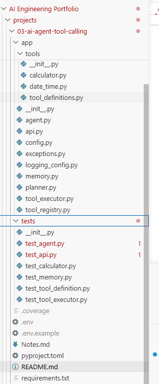
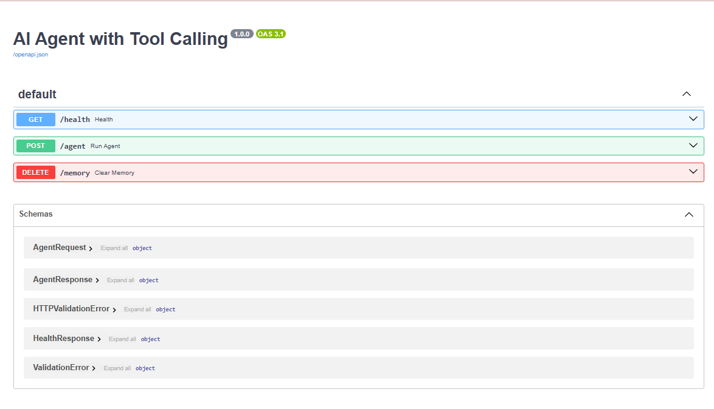
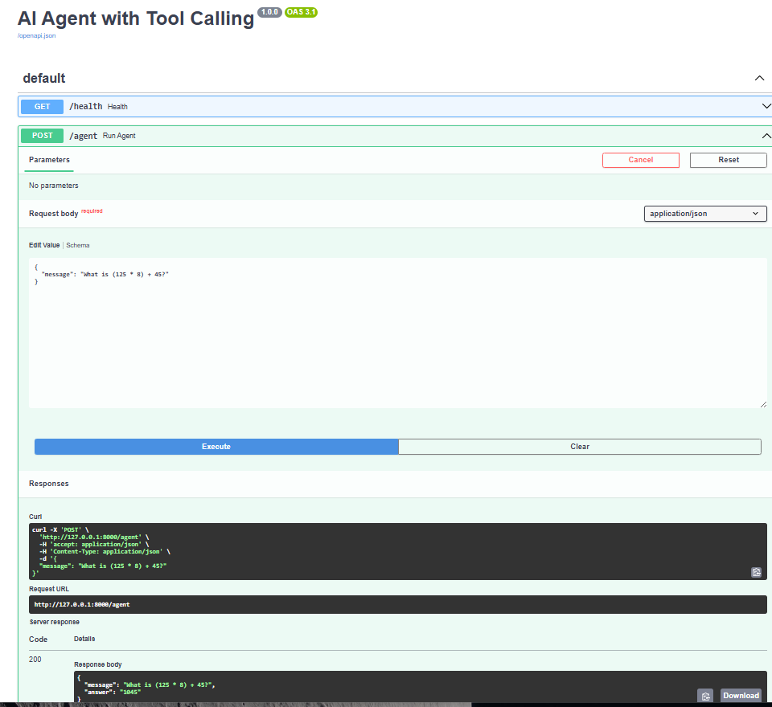
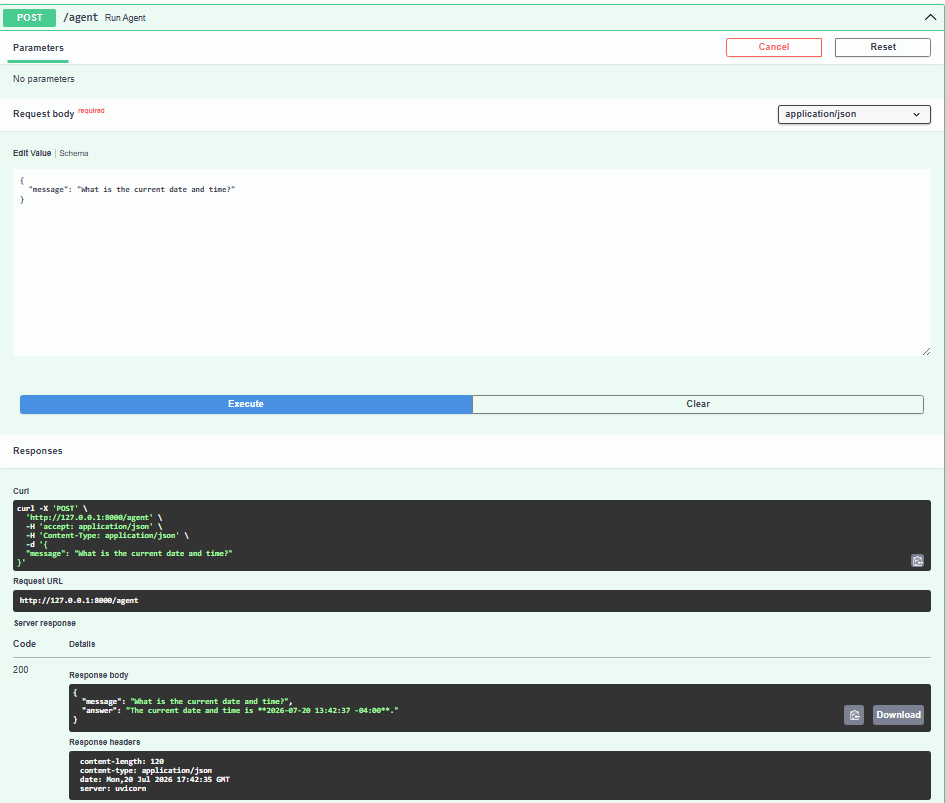

# Project 03 – AI Agent with Tool Calling

> Build a production-style AI Agent using the OpenAI Responses API, Function Calling, FastAPI, and modern software engineering practices.

---

## Overview

This project demonstrates how to build a modular AI Agent capable of planning, tool invocation, and response generation using the OpenAI Responses API.

Unlike a traditional chatbot that relies entirely on the language model, this agent determines when external tools should be used, executes those tools, and incorporates their results into the final response.

The project emphasizes clean architecture, separation of concerns, modular design, automated testing, and production-ready engineering practices.

This repository is part of my **AI Engineering Portfolio**, where each project builds upon the previous one to demonstrate increasingly advanced AI engineering concepts.

---

# Objectives

This project explores the core architectural concepts behind modern AI Agents.

The primary goals are:

- Build an AI Agent using the OpenAI Responses API
- Implement OpenAI Function Calling (Tool Calling)
- Separate planning from execution
- Create reusable Tool Registry and Tool Executor components
- Demonstrate clean software architecture
- Build production-quality Python code
- Prepare the foundation for more advanced AI agents

---

# Features

| Capability | Status |
|------------|:------:|
| OpenAI Responses API | ✅ |
| Function Calling | ✅ |
| Modular Planner | ✅ |
| Tool Registry | ✅ |
| Tool Executor | ✅ |
| Conversation Memory | ✅ |
| Structured Logging | ✅ |
| Configuration Management | ✅ |
| Custom Exceptions | ✅ |
| FastAPI REST API | ✅ |
| Pytest Unit Tests | ✅ |
| Black Formatting | ✅ |
| Ruff Linting | ✅ |
| GitHub Actions CI | ✅ |

---

# Why This Project?

Modern AI applications rarely rely on an LLM alone.

Instead, today's AI systems combine:

- Large Language Models
- External Tools
- Memory
- Retrieval
- APIs
- Workflow orchestration

This project demonstrates the software engineering patterns required to build those systems.

Rather than creating another chatbot, this project focuses on building the infrastructure behind AI agents.

---

# Architecture

```text
                        User
                          │
                          ▼
                  FastAPI Endpoint
                          │
                          ▼
                     Agent
                          │
          ┌───────────────┴───────────────┐
          ▼                               ▼
     Conversation                    Planner
        Memory                  (OpenAI Responses API)
                                          │
                                          ▼
                                   Tool Decision
                                          │
                         ┌────────────────┴───────────────┐
                         ▼                                ▼
                  Direct Response                  Tool Request
                                                        │
                                                        ▼
                                                Tool Executor
                                                        │
                                                        ▼
                                                 Tool Registry
                                                        │
                             ┌──────────────────────────┴──────────────────────────┐
                             ▼                                                     ▼
                      Calculator Tool                                  Date & Time Tool
```

---

# Request Flow

The following sequence illustrates a typical request.

```text
User
 │
 ▼
FastAPI
 │
 ▼
Agent
 │
 ▼
Planner
 │
 ▼
OpenAI Responses API
 │
 ▼
Tool Required?
 │
 ├───────────── No ───────────────► Return Answer
 │
 └───────────── Yes
                 │
                 ▼
         Tool Executor
                 │
                 ▼
        Registered Python Tool
                 │
                 ▼
        Tool Output
                 │
                 ▼
      OpenAI Responses API
                 │
                 ▼
          Final Answer
```

---

# Project Structure

```text
03-ai-agent-tool-calling/
│
├── app/
│   ├── agent.py
│   ├── api.py
│   ├── config.py
│   ├── exceptions.py
│   ├── logging_config.py
│   ├── memory.py
│   ├── planner.py
│   ├── tool_executor.py
│   ├── tool_registry.py
│   │
│   └── tools/
│       ├── calculator.py
│       ├── date_time.py
│       └── tool_definitions.py
│
├── tests/
│
├── requirements.txt
├── pyproject.toml
├── .env.example
└── README.md
```

---

# Component Overview

## agent.py

The Agent is responsible for orchestrating the complete workflow.

Responsibilities:

- Receive user requests
- Manage conversation memory
- Coordinate planning
- Execute requested tools
- Continue the reasoning loop
- Return the final response

The Agent intentionally contains no business logic for individual tools.

---

## planner.py

The Planner is the only component that communicates directly with the OpenAI Responses API.

Responsibilities:

- Send conversation history
- Provide tool definitions
- Generate model responses
- Continue conversations after tool execution

Separating the Planner keeps LLM-specific code isolated from the rest of the application.

---

## tool_registry.py

The Tool Registry maps tool names to Python functions.

Example:

```python
TOOL_REGISTRY = {
    "calculate": calculate,
    "get_current_datetime": get_current_datetime,
}
```

Adding a new tool requires only:

1. Create the function.
2. Register it.
3. Add the tool definition.

No changes are required in the Agent.

---

## tool_executor.py

The Tool Executor provides a single location for executing all tools.

Responsibilities:

- Parse JSON arguments
- Locate tools
- Execute functions
- Handle exceptions
- Log execution
- Return OpenAI-compatible responses

This avoids duplicated execution logic across tools.

---

## memory.py

ConversationMemory stores the current conversation.

Current implementation:

- In-memory storage
- Configurable history size
- Automatic trimming

Future enhancements may include:

- Redis
- SQLite
- PostgreSQL
- Vector databases

---

## config.py

Centralized application configuration.

Configuration is loaded from environment variables and validated during startup.

Current settings include:

- OpenAI API Key
- Model
- Maximum tool iterations
- Logging level

---

## logging_config.py

Provides structured logging across the application.

Example log output:

```text
2026-07-20 10:15:08 | INFO | app.agent | Agent iteration 2
```

Using the standard logging module instead of print statements allows:

- Adjustable log levels
- Better diagnostics
- Easier production deployment

---

## exceptions.py

Defines custom exceptions for the application.

Examples:

- AgentError
- UnknownToolError
- ToolExecutionError
- InvalidAgentRequestError
- AgentMaxIterationsError

Custom exceptions make failures easier to understand and test.

---

# Current Tools

## Calculator

Uses Python's Abstract Syntax Tree (AST) module instead of eval().

Supported operations:

- Addition
- Subtraction
- Multiplication
- Division
- Exponentiation
- Parentheses

Unsafe code execution is prevented.

Example:

```

What is (125 * 8) + 45?

```

Output:

```

1045

```

---

## Current Date & Time

Returns the current local system date and time.

Example:

```

What time is it?

```

Output:

```

2026-07-20T14:32:18-04:00

```

---

# Example Conversations

### Example 1 – Calculator

User

```

What is (100 + 50) / 5?

```

Agent

```

30

```

---

### Example 2 – Date

User

```

What is today's date?

```

Agent

```

2026-07-20

```

---

### Example 3 – Direct LLM Response

User

```

Explain prompt engineering.

```

Since no external tool is required, the Planner returns a direct LLM response without invoking the Tool Executor.

---

# Installation

## Prerequisites

- Python 3.12+
- OpenAI API Key
- Git

---

## Clone the Repository

```powershell
git clone https://github.com/<your-github-username>/ai-engineering-portfolio.git

cd ai-engineering-portfolio/projects/03-ai-agent-tool-calling
```

---

## Create a Virtual Environment

```powershell
python -m venv .venv
```

Activate:

```powershell
.\.venv\Scripts\Activate.ps1
```

---

## Install Dependencies

```powershell
pip install -r requirements.txt
```

---

# Configuration

Create a `.env` file in the project root.

Example:

```text
OPENAI_API_KEY=your_openai_api_key
OPENAI_MODEL=gpt-5.4-mini

AGENT_MAX_ITERATIONS=5
LOG_LEVEL=INFO
```

Never commit your `.env` file.

---

# Running the Application

Start the FastAPI server.

```powershell
uvicorn app.api:app --reload
```

Open:

```
http://127.0.0.1:8000/docs
```

Swagger UI will appear.

---

# REST API

## Health Endpoint

```
GET /health
```

Response

```json
{
  "status": "ok"
}
```

---

## Agent Endpoint

```
POST /agent
```

Example Request

```json
{
  "message": "What is (125 * 8) + 45?"
}
```

Example Response

```json
{
  "message": "What is (125 * 8) + 45?",
  "answer": "1045"
}
```

---

## Clear Memory

```
DELETE /memory
```

Response

```json
{
    "status": "conversation memory cleared"
}
```

---

# Running Tests

Run all tests.

```powershell
pytest
```

Run individual tests.

```powershell
python -m tests.test_calculator

python -m tests.test_memory

python -m tests.test_tool_executor

python -m tests.test_agent

python -m tests.test_api
```

---

# Code Quality

## Format

```powershell
black app tests
```

---

## Lint

```powershell
ruff check app tests
```

---

## Auto-fix

```powershell
ruff check app tests --fix
```

---

# Continuous Integration

GitHub Actions automatically runs:

- Ruff
- Black
- Pytest

on every Push and Pull Request.

Workflow:

```
.github/workflows/project-03-tests.yml
```

---

# Engineering Practices

This project intentionally follows software engineering best practices rather than being a simple AI demo.

Implemented practices include:

- Separation of Concerns
- Single Responsibility Principle
- Modular Design
- Configuration Validation
- Environment Variables
- Structured Logging
- Type Hints
- Custom Exceptions
- Automated Testing
- Continuous Integration

---

# Design Decisions

## Why Planner?

The Planner isolates all interactions with the OpenAI Responses API.

Benefits:

- Easier testing
- Easier model replacement
- Cleaner Agent implementation

---

## Why Tool Registry?

The Tool Registry allows new tools to be added without modifying the Agent.

Instead of large if/elif statements, tools are dynamically resolved.

---

## Why Tool Executor?

All execution logic exists in one location.

Responsibilities include:

- JSON parsing
- Function invocation
- Logging
- Exception handling

This keeps tool implementations simple.

---

## Why Conversation Memory?

Conversation history is independent of planning.

Future implementations can replace in-memory storage with:

- Redis
- PostgreSQL
- SQLite
- Vector databases

without changing Agent logic.

---

## Why Configuration Object?

Instead of global constants, all configuration is loaded into a validated Settings object.

Benefits include:

- Type safety
- Validation
- Single source of truth
- Easier testing

---

# Current Limitations

Current implementation intentionally remains simple.

Limitations include:

- In-memory conversation history
- No persistent storage
- Limited tool set
- No authentication
- No streaming responses
- No distributed tracing

These will be addressed in future projects.

---

# Future Enhancements

Planned improvements include:

- Enterprise RAG Tool (Project 02 integration)
- Web Search Tool
- Weather Tool
- Email Tool
- Calendar Tool
- Persistent Conversation Memory
- Multi-Agent Collaboration
- Streaming Responses
- Docker Support
- AWS Deployment
- Azure Deployment
- Observability and Tracing
- MCP Integration (Project 04)

---

# Technologies Used

| Category | Technology |
|----------|------------|
| Language | Python 3.12 |
| AI | OpenAI Responses API |
| Backend | FastAPI |
| Configuration | python-dotenv |
| Validation | Pydantic |
| Testing | pytest |
| Formatting | Black |
| Linting | Ruff |
| CI | GitHub Actions |

---

# Skills Demonstrated

This project demonstrates practical experience with:

- AI Agent Architecture
- Tool Calling
- OpenAI Responses API
- Prompt Engineering
- Function Dispatch
- Python
- FastAPI
- REST APIs
- Object-Oriented Design
- Software Architecture
- Testing
- CI/CD
- Logging
- Configuration Management

---

# Key Learnings

Through this project I gained practical experience in:

- Building modular AI agents
- Designing extensible software architecture
- Implementing OpenAI Function Calling
- Creating reusable Python components
- Building production-style APIs
- Writing automated tests
- Applying modern engineering best practices

---


# Screenshots

Repository Structure:



Swagger UI:



Calculator Request:



Date & Time Request:



---


# Related Projects

This project is part of a larger AI Engineering Portfolio.

| Project | Description |
|----------|-------------|
| Project 01 | AI Chat Service |
| Project 02 | Enterprise Retrieval-Augmented Generation (RAG) |
| **Project 03** | AI Agent with Tool Calling |
| Project 04 *(Coming Soon)* | Model Context Protocol (MCP) |
| Project 05 *(Planned)* | Multi-Agent Systems |
| Project 06 *(Planned)* | AI Evaluation & Observability |

---

# About This Portfolio

This repository documents my hands-on journey in AI Engineering.

Each project builds upon the previous one, progressing from foundational LLM integration to Retrieval-Augmented Generation, AI Agents, and eventually Model Context Protocol (MCP) and production deployment.

The focus throughout the portfolio is on applying software engineering principles to AI systems, demonstrating how modern AI applications can be designed, tested, deployed, and maintained using production-ready practices.

---

---

## Acknowledgements

Built using:

- OpenAI Responses API
- FastAPI
- Python
- Pytest
- Black
- Ruff

---

**Project Status**

✅ Completed

Current Version: **1.0**

The next step in this portfolio is **Project 04 – Model Context Protocol (MCP)**, which will extend this agent by connecting it to external tool servers using the emerging MCP standard.
